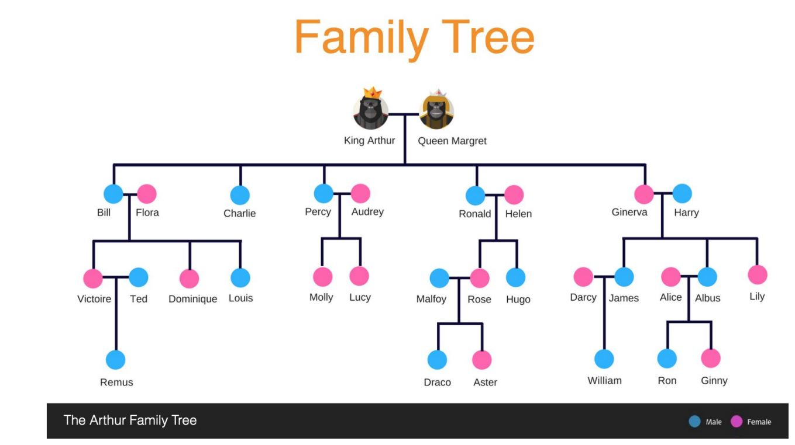

# Family-Tree

This project is to demonstrate knowledge of Java, and OO principle design.

A family tree of a particular family is designed and implemented. GIven a 'name' and 'relationship', it outputs the people corresponding to the relationship in the ordeer in which they are added in family tree and it also allows to add a child to any family in tree through the mother.

The program reads text from a text file as a parameter while running the application.

Relationship defined are: 
Son, Daughter, Siblings, Husband, Wife, Father, Mother, Brother, Sister, Paternal_Uncle,Maternal_Uncle,Paternal_Aunt,Maternal_Aunt,Sister_In_Law,Brother_In_Law

Sample input/Output:  
ADD_CHILD "MothersName" "ChildName" "Gender" 
eg: Input - ADD_CHILD Flora Pooja Female  
Output - CHILD_ADDED 
GET_RELATIONSHIP "Name" "Relationship" 
eg: Input -  GET_RELATIONSHIP Pooja Siblings 
Output - Victoire Dominique Louis  
Following figure depicts sample family tree: 

